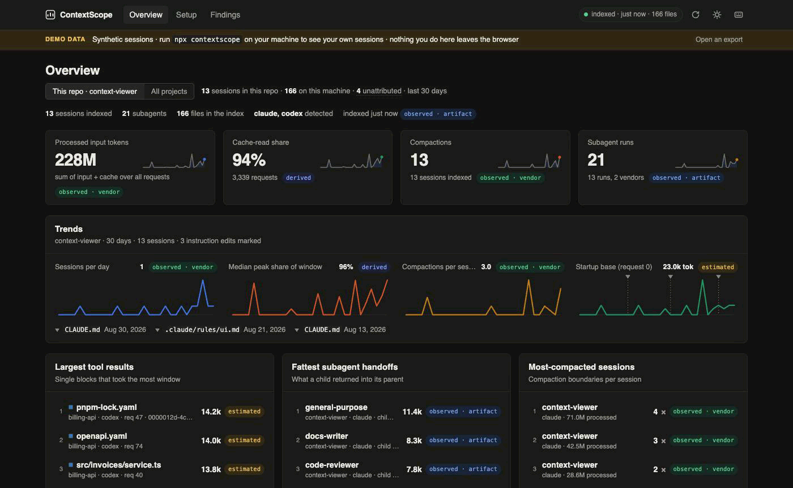
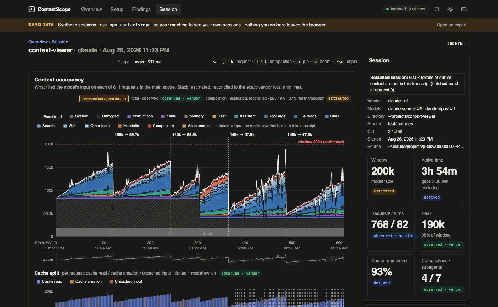

# ContextScope

**See what fills your coding agent's context window, and fix the setup that fills it.**

ContextScope is a local profiler for Claude Code and Codex. It reads the session transcripts both tools already keep
on disk, together with your repository's agent setup (`CLAUDE.md`, `AGENTS.md`, rules, skills, agents, hooks, MCP
servers). From these it rebuilds, request by request, what the model actually had in its input. It then tells you
which single setup change to make first: the file to edit and the line to add.

- **Local-first.** No account, no model call, no upload, no analytics. The index keeps sizes, hashes and token counts,
  never message text, tool output or file contents.
- **Honest numbers.** Every number carries its provenance (`observed · vendor`, `derived`, `estimated`), and estimates
  are reconciled to the vendor's exact per-request totals.
- **From diagnosis to CI.** The same rules run in the browser UI, in a terminal report and as a CI gate
  (`contextscope check`) that fails a pull request when the setup regresses.



> **Status:** 0.11.0, not yet published to npm (see [`docs/publishing.md`](docs/publishing.md)). Run it from this
> repository for now. Once published, `npx contextscope` replaces the `node …/contextscope.mjs` calls below.

---

## Contents

- [Why](#why)
- [Quick start](#quick-start)
- [What you get](#what-you-get)
- [Use it in CI](#use-it-in-ci)
- [How it works](#how-it-works)
- [Privacy](#privacy)
- [Limitations](#limitations)
- [Repository layout](#repository-layout)
- [Development](#development)
- [License](#license)

## Why

A 1M-token window is a million tokens of room, not a million tokens of attention: recall degrades as the context
grows. In practice most of a coding agent's window is not your instructions. It is file reads, shell output, tool
arguments and subagent handoffs, plus the instruction files and tool schemas you pay for in every request of every
session. `/context` shows you one moment of one session. ContextScope shows you all of them, finds the patterns that
repeat across sessions, and ranks the fixes by how many sessions they would help.

## Quick start

Requirements: Node 20 or newer, and some Claude Code or Codex sessions on this machine. The CLI has no runtime
dependencies, and the UI bundle is already built into `packages/cli/ui/`.

```bash
git clone https://github.com/open-mercato/context-scope.git
cd /path/to/your/project
node /path/to/context-scope/packages/cli/src/contextscope.mjs
```

This binds a random loopback port, opens the browser and shows a consent screen listing exactly which directories
will be read. Indexing starts only after you approve. The repository you launch from is the one analysed; use
`--repo <path>` to point elsewhere.

To get a `contextscope` command on your `PATH` that tracks this checkout:

```bash
cd context-scope/packages/cli && npm link
cd /path/to/your/project && contextscope
```

Without the UI:

```bash
contextscope scan            # terminal report: cost by tool, the first change to make, habits, findings
contextscope check           # setup gate: startup budget, file sizes, missing references, S-* rules
contextscope status          # diagnostics in under 300 ms: vendors, index, hooks, running companion
contextscope help            # every command and flag
```

Run one companion at a time. Every companion writes the same index under `~/.contextscope`.

## What you get

| Screen | What it answers |
|---|---|
| **Overview** | Sessions of this repo (or the whole machine) with peak occupancy, compactions and subagents. **Context at session end**: a 100 % bar of what the main context held on each session's last request, averaged over sessions (switchable to a sorted bar chart). The one change to make first, daily trends with instruction-file edit markers, the largest tool results, the fattest subagent handoffs. |
| **Session** | **Context at session end** for this session. Click a category to split it by tool or file, e.g. *Tool args → Write / Edit / Bash*, *File reads → the files*. Below it: the occupancy chart request by request, stacked by category with compactions and the exact vendor total; cache split; subagent lanes (peak → handoff → compression ratio); heavy hitters; cost per tool; a ledger; the session's findings; a live compaction forecast. |
| **Setup** | The instruction chain, skills, agents, hooks, MCP servers and the estimated startup budget, next to what sessions actually loaded. Each instruction file has a before/after table of sessions around each edit. |
| **Findings** | Every finding grouped by rule, ranked by severity, tokens affected and the number of sessions it recurs in, each with a concrete fix. |



### Rules

| Family | Looks at | Examples |
|---|---|---|
| `S-01`…`S-12` setup | the repository's agent configuration | oversized instruction chain, duplicate instruction blocks, references to missing paths, skills without a description or with invalid frontmatter, unscoped rules, MCP servers that are never used, hooks with large stdout |
| `B-01`…`B-17` session | one session and its subagents | fat tool results, huge file reads, search floods, repeated identical calls, fat subagent handoffs, frequent compaction, running hot, cache churn, tool arguments dominating the window |
| `H-01`…`H-07` habit | every session of the repo | the same fat read in session after session, a subagent type whose handoffs are routinely oversized, compaction arriving earlier over time, a startup base that keeps growing |

Thresholds are documented in [`packages/cli/src/rules/thresholds.md`](packages/cli/src/rules/thresholds.md). They are
product opinions, not facts, and every one can be overridden.

### Did my change help?

```bash
contextscope experiment start slim-agents-md   # snapshot the instruction chain
# edit AGENTS.md, work a few sessions
contextscope experiment candidate slim-agents-md
contextscope experiment compare slim-agents-md
```

The before/after comparison (also shown per file on the Setup screen) is observational: the sessions on each side
are different tasks, and every row says so, with `n` per side and a confidence interval only from 5 sessions per side.

## Use it in CI

`contextscope check` evaluates only the repository's setup. It reads no sessions and nothing under `~`, so a laptop
and a runner give the same verdict, in about a second. Configuration lives in `.contextscope.json`:

```json
{
  "budgets": { "startupTokens": 6000, "instructionFileTokens": 3000 },
  "failOn": "high",
  "ignore": ["test/fixtures/**"]
}
```

```yaml
# .github/workflows/agent-setup.yml
- uses: actions/setup-node@v4
  with: { node-version: 22 }
- run: npx contextscope check --fail-on high --github   # annotations on the PR; exit 0 pass, 1 fail, 2 usage, 3 crash
```

Until the package is on npm, check out this repository in the job and run
`node <checkout>/packages/cli/src/contextscope.mjs check --repo . --fail-on high --github` instead.

The check skips directories git ignores and nested repositories (worktrees, submodules), and lists what it skipped.
Missing-reference detection resolves module-relative paths (`data/validators.ts`), import specifiers and generated
files. It ignores examples, placeholders, MIME types, model ids and route ids. It is still a heuristic, so read
[the limitations](#limitations). This repository runs the same gate on itself in
[`.github/workflows/check.yml`](.github/workflows/check.yml).

## How it works

```
transcripts (~/.claude/projects, ~/.codex/sessions) ─┐
repository setup (CLAUDE.md, AGENTS.md, .claude/, …) ─┤
                                                      ▼
  adapters ─► IR (runs → scopes → requests → blocks) ─► reconcile ─► rules (S / B / H) ─► index ─► UI · scan · check
```

- **Adapters** parse vendor transcripts into one intermediate representation: runs, agent scopes, requests, and
  blocks with an estimated size, category, tool and a safe label. Content is hashed and dropped.
- **Reconciliation** scales the per-block estimates so each request sums to the vendor's exact token total. Whatever
  the transcript cannot explain is split into `system` (system prompt and tool schemas), `instructions` and
  `unlogged` (e.g. resumed history), so no number is invented.
- **Rules** turn the IR and the setup inventory into findings with evidence, a fix, and the sessions they recur in.
- **Index** under `~/.contextscope/index` is incremental. Editing a rule or a threshold re-evaluates stored runs
  without re-parsing.

The architecture decisions are in [`docs/adr-001-product-architecture.md`](docs/adr-001-product-architecture.md). The
transcript formats are documented in [`docs/format-claude-code.md`](docs/format-claude-code.md) and
[`docs/format-codex.md`](docs/format-codex.md).

## Privacy

What leaves the machine: nothing.

- The index and every export hold sizes, content hashes, tool names, token counts, repo-relative labels and findings.
  They never hold message text, prompts, tool output, file contents, or absolute paths outside your home directory. A
  release-gate test runs the real adapters over fixtures and fails if content or absolute paths reach the index, the
  API or an export.
- The companion listens on `127.0.0.1` only, with a per-launch token, a `Host` check and no cross-origin writes.
- `contextscope export --redact-labels` hashes every label and path with a per-export salt, so a session can be
  shared outside the team.
- `contextscope hooks install` (optional) captures Claude Code runtime events, such as which instruction files were
  actually loaded. It previews the diff first, backs up `settings.json` under `~/.contextscope/backups`, and is
  reversible.

The full statement, including every file ContextScope writes, is in
[`packages/cli/README.md`](packages/cli/README.md#privacy-statement).

## Limitations

- Per-block sizes are local estimates (`estimated`), reconciled to exact vendor totals. The session screen shows the
  estimator error for each scope.
- "In the window" means present, not attended to. ContextScope measures occupancy and cost, not what the model used.
- Before/after comparisons are observational. There is no task runner or grader yet, and no causal claim.
- Gemini CLI sessions are detected and counted but not parsed.
- The setup rules and missing-reference detection are heuristics. They have been tuned against one real monorepo, but
  not validated on a labelled set of repositories.
- The capture hook is POSIX-only.

## Repository layout

| Path | What |
|---|---|
| [`packages/cli`](packages/cli) | The npm package `contextscope`: adapters, IR, reconciliation, rules, index, the loopback companion and every command. Plain ESM Node, zero dependencies. Its README is the user-facing contract. |
| [`packages/ui`](packages/ui) | The browser UI (Preact + signals, esbuild), built into `packages/cli/ui/`. The same bundle serves the hosted demo and opens exported sessions. |
| `app/`, `public/` | The public site: landing page, hosted demo (`/app/index.html?demo=1`) and export opener. |
| [`docs/`](docs) | ADRs, reviews, research ([`context-engineering-research.md`](docs/context-engineering-research.md)) and the release checklist. |
| [`.github/workflows`](.github/workflows) | `check.yml`: CLI tests on Node 20/22, UI build, pack dry run, and `contextscope check` over this repo. `publish.yml`: npm publish with provenance on a `v*` tag. |

## Development

```bash
# CLI
cd packages/cli
npm test                                   # node --test test/*.test.mjs
node src/contextscope.mjs start --yes --no-open --json   # machine mode: { url, … } then one JSON line per index event

# UI
cd packages/ui
npm install
npm run build                              # esbuild → packages/cli/ui/
npm run dev                                # fixture server on http://127.0.0.1:4177/?token=dev
node dev/make-fixtures.mjs [--demo]        # regenerate dev fixtures / the hosted demo dataset
node dev/validate-fixtures.mjs [--demo]

# Site
npm install
npm run dev                                # landing + demo on a local worker
npm test                                   # build, then rendered-HTML, demo-asset and privacy tests
```

A running companion reads the UI bundle from disk, so a UI rebuild shows up on reload. CLI changes need a restart of
the companion.

## License

MIT, see [`packages/cli/LICENSE`](packages/cli/LICENSE).
